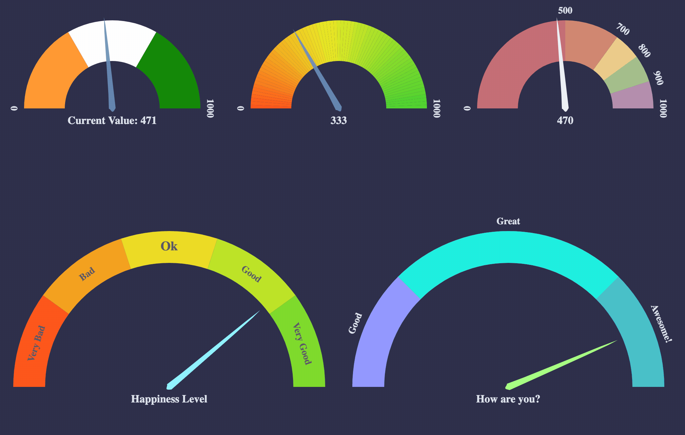

# react-d3-speedometer

> React library for showing speedometer like gauge using d3.




[](https://circleci.com/gh/palerdot/react-d3-speedometer)
[](https://codecov.io/gh/palerdot/react-d3-speedometer)
[](https://www.npmjs.com/package/react-d3-speedometer)
[](https://www.npmjs.com/package/react-d3-speedometer)
[](https://github.com/prettier/prettier)


**Note**: `v2.x` is compatible with `React v18`. `v1.x` is compatible with `React 17`. Please use latest `v0.x` (`v0.14.1` at the time of writing) if you are using `React 16`.

[](https://npmjs.org/package/react-d3-speedometer)


# `react-d3-speedometer`

- [Getting Started](#getting-started)
- [Configuration Options](#configuration-options)
- [Examples](#examples)
- [FAQ](#faq)
- [Ports](#ports)

## Getting Started:

Install with `yarn` or `npm`.

**Yarn:**
```
yarn add react-d3-speedometer
```

**npm:**

```
npm install --save react-d3-speedometer
``` 

And, use it like

```javascript
// import the component
import ReactSpeedometer from "react-d3-speedometer"
// and just use it
<ReactSpeedometer />
```

### Slim Build:

There is a `Slim` build available without bundling `d3`. This project uses `d3` *micro bundles*. If your project also uses `d3` *microbundles*, you can opt for **slim build**. Necessary `d3` dependencies required for slim build to work are - `d3-array`, `d3-color`, `d3-ease`, `d3-format`, `d3-interpolate`, `d3-scale`, `d3-selection`, `d3-shape`, `d3-transition`. 
```javascript
// sample slim build usage
import ReactSpeedometer from "react-d3-speedometer/slim"
// and use it
<ReactSpeedometer />
```

[Live Examples](https://palerdot.in/react-d3-speedometer)

## Configuration Options:

| prop        | type           | default  | comments |
| ------------|:--------------:| --------:| ---------|
| value       | Number         | 0        |   Make sure your value is between your `minValue` and `maxValue`       |
| minValue    | Number         | 0        |          |
| maxValue    | Number         | 1000     |          |
| segments    | Number         | 5        | Number of segments in the speedometer. Please note, `segments` is calculated with [d3-ticks]() which is an approximate count that is uniformly spaced between min and max. Please refer to [d3-ticks](https://github.com/d3/d3-scale/blob/master/README.md#continuous_ticks) and [d3-array ticks](https://github.com/d3/d3-array#ticks) for more detailed info.        |
| maxSegmentLabels    | Number         | value from 'segments' prop        | Limit the number of segment labels to displayed. This is useful for acheiving a gradient effect by giving arbitrary large number of `segments` and limiting the labels with this prop. [See Live Example](https://palerdot.in/react-d3-speedometer/?path=/story/react-d3-speedometer--gradient-effect-with-large-number-of-segments-and-maxsegmentlabels-config). Please note, `maxSegmentLabels` is calculated with [d3-ticks]() which is an approximate count that is uniformly spaced between min and max. Please refer to [d3-ticks](https://github.com/d3/d3-scale/blob/master/README.md#continuous_ticks) and [d3-array ticks](https://github.com/d3/d3-array#ticks) for more detailed info.        |
| forceRender | Boolean        | false    | After initial rendering/mounting, when props change, only the `value` is changed and animated to maintain smooth visualization. But, if you want to force rerender the whole component like change in segments, colors, dimensions etc, you can use this option to force rerender of the whole component on props change.         |
| width       | Number         | 300      | **diameter** of the speedometer and the **width** of the svg element |
| height      | Number         | 300      | height of the svg element. Height of the speedometer is always half the width since it is a **semi-circle**. For fluid width, please refere to `fluidWidth` config |
| dimensionUnit | String         | px     | Default to `px` for `width/height`. Possible values - `"em" , "ex" , "px" , "in" , "cm" , "mm" , "pt" , ,"pc"` ... Please refer to [specification](https://developer.mozilla.org/en-US/docs/Web/SVG/Content_type#Length) for more details |
| fluidWidth  | Boolean        | false    | If `true` takes the width of the parent component. See [Live Example](https://palerdot.in/react-d3-speedometer/?selectedKind=React%20d3%20Speedometer&selectedStory=Fluid%20Width%20view&full=0&down=0&left=1&panelRight=0&downPanel=kadirahq%2Fstorybook-addon-actions%2Factions-panel) for more details |
| needleColor | String         | steelblue | Should be a valid color code - colorname, hexadecimal name or rgb value. Should be a valid input for [d3.interpolateHsl](https://github.com/d3/d3-interpolate#interpolateHsl)   |
| startColor | String         | #FF471A | Should be a valid color code - colorname, hexadecimal name or rgb value. Should be a valid input for [d3.interpolateHsl](https://github.com/d3/d3-interpolate#interpolateHsl)   |
| endColor | String         |  #33CC33 | Should be a valid color code - colorname, hexadecimal name or rgb value. Should be a valid input for [d3.interpolateHsl](https://github.com/d3/d3-interpolate#interpolateHsl)   |
| segmentColors | Array (of colors)         |  [] | Custom segment colors can be given with this option. Should be an array of valid color codes. If this option is given **startColor** and **endColor** options will be ignored. |
| needleTransition | String (JS) / Transition (TS)        | easeQuadInOut | [d3-easing-identifiers](https://github.com/d3/d3-ease) - easeLinear, easeQuadIn, easeQuadOut, easeQuadInOut, easeCubicIn, easeCubicOut, easeCubicInOut, easePolyIn, easePolyOut, easePolyInOut, easeSinIn, easeSinOut, easeSinInOut, easeExpIn, easeExpOut, easeExpInOut, easeCircleIn, easeCircleOut, easeCircleInOut, easeBounceIn, easeBounceOut, easeBounceInOut, easeBackIn, easeBackOut, easeBackInOut, easeElasticIn, easeElasticOut, easeElasticInOut, easeElastic. There is a helper Object/Type 'Transtion', which you can import like `import { Transition } from 'react-d3-speedometer'` and use it like `Transition.easeElastic`. This works for both JS and Typescript. For `type(script)` definitions, please refer [here](./src/index.d.ts). |
| needleTransitionDuration | Number         | 500     | Time in milliseconds. |
| needleHeightRatio | Float (between 0 and 1)         | 0.9     | Control the height of the needle by giving a number/float between `0` and `1`. Default height ratio is `0.9`.  |
| ringWidth | Number         | 60     | Width of the speedometer ring. |
| textColor | String         | #666     | Should be a valid color code - colorname, hexadecimal name or rgb value. Used for both showing the current value and the segment values |
| valueFormat | String       |  | should be a valid format for [d3-format](https://github.com/d3/d3-format#locale_format). By default, no formatter is used. You can use a valid d3 format identifier (for eg: `d` to convert float to integers), to format the values. **Note:** This formatter affects all the values (current value, segment values) displayed in the speedometer |
| segmentValueFormatter | Function | value => value     | Custom segment values formatter function. This function is applied after 'valueFormat' prop if present. |
| currentValueText | String | ${value} | Should be provided a string which should have **${value}** placeholder which will be replaced with current value. By default, current value is shown (formatted with `valueFormat`). For example, if current Value is 333 if you would like to show `Current Value: 333`, you should provide a string **`Current Value: ${value}`**. See [Live Example](https://palerdot.in/react-d3-speedometer/?selectedKind=react-d3-speedometer&selectedStory=Custom%20Current%20Value%20Text&full=0&down=1&left=1&panelRight=0) |
| currentValuePlaceholderStyle | String | ${value} | Should be provided a placeholder string which will be replaced with current value in `currentValueTextProp`. For example: you can use ruby like interpolation by giving following props - `<ReactSpeedometer    currentValueText="Current Value: #{value}" currentValuePlaceholderStyle={"#{value}"} />`. This is also helpful if you face `no-template-curly-in-string` eslint warnings and would like to use different placeholder for current value |
| customSegmentStops | Array         | []     | Array of values **starting** at `min` value, and **ending** at `max` value. This configuration is useful if you would like to split the segments at custom points or have unequal segments at preferred values. If the values does not begin and end with `min` and `max` value respectively, an error will be thrown. This configuration will override `segments` prop, since total number of segments will be `length - 1` of `customSegmentProps`. For example, `[0, 50, 75, 100]` value will have three segments - `0-50`, `50-75`, `75-100`. See [Live Example](https://palerdot.in/react-d3-speedometer/?path=/story/react-d3-speedometer--custom-segment-stops) |
| customSegmentLabels | Array`<CustomSegmentLabel>` | [] | Takes an array of `CustomSegmentLabel` objects. Each object has following keys for custom rendering of labels - `text`, `fontSize`, `color`, `position: OUTSIDE/INSIDE`. For `position`, there is a helper `CustomSegmentLabelPosition` Object/Type which you can import like `import { CustomSegmentLabelPosition } from 'react-d3-speedometer'`, and use it like `CustomSegmentLabelPosition.Inside / CustomSegmentLabelPosition.Outside`. This works for both JS and Typescript. For `type(script)` definitions, please refer [here](./src/index.d.ts).  |
| labelFontSize | String         | 14px     | Font size for segment labels/legends |
| valueTextFontSize | String         | 16px     | Font size for current value text |
| valueTextFontWeight | String         | bold     | Font weight for current value text. Any valid font weight identifier (500, bold etc) can be used. |
| paddingHorizontal | Number         | 0     | Provides right/left space for the label text. Takes a number (without explicit unit, unit will be taken from dimensionUnit config which defaults to px). Helpful when using a bigger font size for label texts. |
| paddingVertical   | Number         | 0     | Provides top/bottom space for the current value label text below the needle. Takes a number (without explicit unit, unit will be taken from dimensionUnit config which defaults to px). Helpful when using a bigger font size for label texts. |
| svgAriaLabel      | String      | React d3 speedometer     | SVG aria-label property for Accessibility purposes |

## Examples

You can view [Live Examples here](https://palerdot.in/react-d3-speedometer/?path=/story/react-d3-speedometer--default-with-no-config)

#### Default with no config - [Live Example](https://palerdot.in/react-d3-speedometer/?path=/story/reactspeedometer--default-with-no-config)

```javascript
<ReactSpeedometer />
```

#### With configurations - [Live Example](https://palerdot.in/react-d3-speedometer/?path=/story/reactspeedometer--configuring-values)

```javascript
<ReactSpeedometer
  maxValue={500}
  value={473}
  needleColor="red"
  startColor="green"
  segments={10}
  endColor="blue"
/>
```

#### Custom Segment Colors - [Live Example](https://palerdot.in/react-d3-speedometer/?path=/story/reactspeedometer--custom-segment-colors)

```javascript
<ReactSpeedometer
  value={333}
  segments={5}
  segmentColors={[
    "#bf616a",
    "#d08770",
    "#ebcb8b",
    "#a3be8c",
    "#b48ead",
  ]}
  // startColor will be ignored
  // endColor will be ignored
/>
```

#### Custom Segment Labels - [Live Example](https://palerdot.in/react-d3-speedometer/?path=/story/reactspeedometer--custom-segment-labels)

```javascript
  // 'customSegmentLabels' prop takes an array of 'CustomSegmentLabel' Object
  /*
  type CustomSegmentLabel = {
    text?: string
    position?: OUTSIDE/INSIDE
    fontSize?: string
    color?: string
  }
  */

  <ReactSpeedometer
    value={777}
    currentValueText="Happiness Level"
    customSegmentLabels={[
      {
        text: "Very Bad",
        position: "INSIDE",
        color: "#555",
      },
      {
        text: "Bad",
        position: "INSIDE",
        color: "#555",
      },
      {
        text: "Ok",
        position: "INSIDE",
        color: "#555",
        fontSize: "19px",
      },
      {
        text: "Good",
        position: "INSIDE",
        color: "#555",
      },
      {
        text: "Very Good",
        position: "INSIDE",
        color: "#555",
      },
    ]}
  />
```

#### Custom Segment Stops - [Live Example](https://palerdot.in/react-d3-speedometer/?path=/story/reactspeedometer--custom-segment-stops)

```javascript
  <ReactSpeedometer
    customSegmentStops={[0, 500, 750, 900, 1000]}
    segmentColors={["firebrick", "tomato", "gold", "limegreen"]}
    value={333}
  />
  // `segments` prop will be ignored since it will be calculated from `customSegmentStops`
  // In this case there will be `4` segments (0-500, 500-750, 750-900, 900-1000)
/>
```

#### Fluid Width Example - [Live Example](https://palerdot.in/react-d3-speedometer/?path=/story/reactspeedometer--fluid-width-view)

```javascript
// Speedometer will take the width of the parent div (500)
// any width passed will be ignored
<div style={{
  width: "500px",
  height: "300px",
  background: "#EFEFEF"
}}>
  <ReactSpeedometer
    fluidWidth={true}
    minValue={100}
    maxValue={500}
    value={473}
    needleColor="steelblue"
  />
</div>
```

#### Needle Transition Example - [Live Example](https://palerdot.in/react-d3-speedometer/?path=/story/reactspeedometer--needle-transition-duration)

```javascript
<ReactSpeedometer
  value={333}
  needleColor="steelblue"
  needleTransitionDuration={4000}
  needleTransition="easeElastic"
/>
```

#### Force Render component on props change - [Live Example](https://palerdot.in/react-d3-speedometer/?path=/story/reactspeedometer--force-render-the-component)

```javascript
// By default, when props change, only the value prop is updated and animated. 
// This is to maintain smooth visualization and to ignore breaking appearance changes like segments, colors etc. 
// You can override this behaviour by giving forceRender: true

// render a component initially
<ReactSpeedometer
  width={200}
  height={200}
/>
// Now, if given forceRender: true, and change the appearance all together, the component will rerender completely on props change
<ReactSpeedometer
  forceRender={true}
  segments={15}
  width={500}
  height={500}
/>
```

#### Needle Height Configuration Example - [Live Example](https://palerdot.in/react-d3-speedometer/?path=/story/reactspeedometer--configure-needle-length-and-font-sizes)

```javascript
<ReactSpeedometer
  value={333}
  needleHeightRatio={0.7}
/>
```

You can give a value between `0` and `1` to control the needle height.


#### Gradient Like Effect - [Live Example](https://palerdot.in/react-d3-speedometer/?path=/story/reactspeedometer--gradient-effect-with-large-number-of-segments-and-max-segment-labels-config)

```javascript
<ReactSpeedometer
  value={333}
  maxSegmentLabels={5}
  segments={1000}
/>
```

### FAQ:


1) How to use with [nextjs](https://nextjs.org/)?


    `react-d3-speedometer` uses [lodash-es](https://www.npmjs.com/package/lodash-es) dependency for better tree shaking. For [nextjs](https://nextjs.org/), please use [next-transpile-modules](https://www.npmjs.com/package/next-transpile-modules), so that ES module exports from `lodash-es` package is properly transpiled. You can also `nextjs` dynamic imports - https://nextjs.org/docs/advanced-features/dynamic-import#with-no-ssr


Please refer to this issue for more details on how to make this library work with `next.js` - https://github.com/palerdot/react-d3-speedometer/issues/89

2) How to use with `React 17`?

    Please use latest `v1.x` (`v1.0.0` at the time of writing). `v1.x` is compatible with `React 17`.

3) How to use with `React 16`?

    Please use latest `v0.x` (`v0.14.x` at the time of writing). `v0.x` is compatible with `React 16`.

---

## Ports:
- Vue: [vue-speedometer](https://github.com/palerdot/vue-speedometer)
- Svelte: [svelte-speedometer](https://github.com/palerdot/svelte-speedometer)

---

### Todos:

- [x] Test coverage (with enzyme)
- [x] Convert entire code base to ES6
- [x] Split core from lifecycles
- [x] Typescript support

---

### Tests:

`react-d3-speedometer` comes with a test suite using [enzyme](https://github.com/airbnb/enzyme).

```javascript
// navigate to root folder and run
npm test
// or 'yarn test' if you are using yarn
```

---

#### Feature Updates:
- [`v1.0.0`] `React v17` support. `d3 v6` support. [Live Example](https://codesandbox.io/s/kind-breeze-esuge?file=/src/App.js) 

- [`v0.14.0`] `valueTextFontWeight` config to control font weight of current value
- [`v0.10.0`] Custom labels. [Live Example](https://codesandbox.io/s/vibrant-platform-cesh3)
- [`v0.9.0`] `Typescript` support
- [`v0.8.0`] `paddingHorizontal`, `paddingVertical` configuration to control spacing around text. [Live Example](https://codesandbox.io/s/blazing-sun-bsm0j)
- [`v0.7.0`] Custom segment stops. [Live Example](https://palerdot.in/react-d3-speedometer/?path=/story/react-d3-speedometer--custom-segment-stops)
- [`v0.6.0`] Custom segment colors. [Live Example](https://codesandbox.io/s/relaxed-silence-c3qkb)

---

#### Changelog:

[View Changelog](CHANGELOG.md)

---

#### Credits:
`react-d3-speedometer` was started as a react port of the following d3 snippet - [http://bl.ocks.org/msqr/3202712](http://bl.ocks.org/msqr/3202712). Component template was initially bootstrapped with [React CDK](https://github.com/storybooks/react-cdk). Also, many thanks to `react` and `d3` ecosystem contributors.

---

#### Contributing:
PRs are welcome. Please create a issue/bugfix/feature branch and create an issue with your branch details. Probably I will create a similar branch in the upstream repo so that PRs can be raised against that branch instead of `master`. [master-v0.x](https://github.com/palerdot/react-d3-speedometer/tree/master-v0.x) is the main branch for `React 16` compatible changes.

#### Notes
- `1.x` versions are compatible with React & React DOM Versions `v17.x`
- `0.x` versions are compatible with React & React DOM Versions `v16.x`
For every subsequent major react upgrade, `react-d3-speedometer` will be bumped to next major versions. For example `1.x` will be compatible with `React 17.x` so on and so forth ...

For similar library for VueJS, please check out [vue-speedometer](https://github.com/palerdot/vue-speedometer).

For similar library for Svelte, please check out [svelte-speedometer](https://github.com/palerdot/svelte-speedometer).

#### License:

[MIT](LICENSE)
